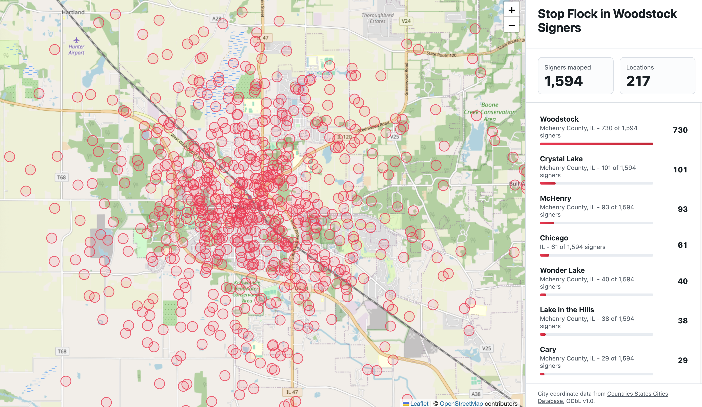

# Stop Flock in Woodstock Signer Map

City-level map of petition signers for Stop Flock in Woodstock.

https://stopflockinwoodstock.github.io/signers-map/



## Privacy

Raw signer files stay local in `input/` and are ignored by Git. Published files contain only aggregate city/state counts and city-level coordinates.

## Build

```sh
npm install
npm run build
```

The published GitHub Pages site is served from `main:/docs`.

## Outputs

- `dist/signer_city_locations.csv`
- `dist/missing_coordinates.csv`
- `docs/index.html`

Coordinates come from `@countrystatecity/countries`, with city-level fallbacks in `data/city_overrides.csv`.

## Attribution

City coordinates are backed by Countries States Cities Database: https://github.com/dr5hn/countries-states-cities-database
